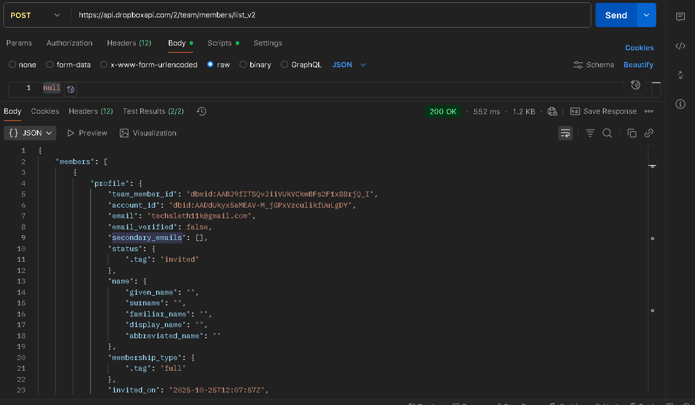
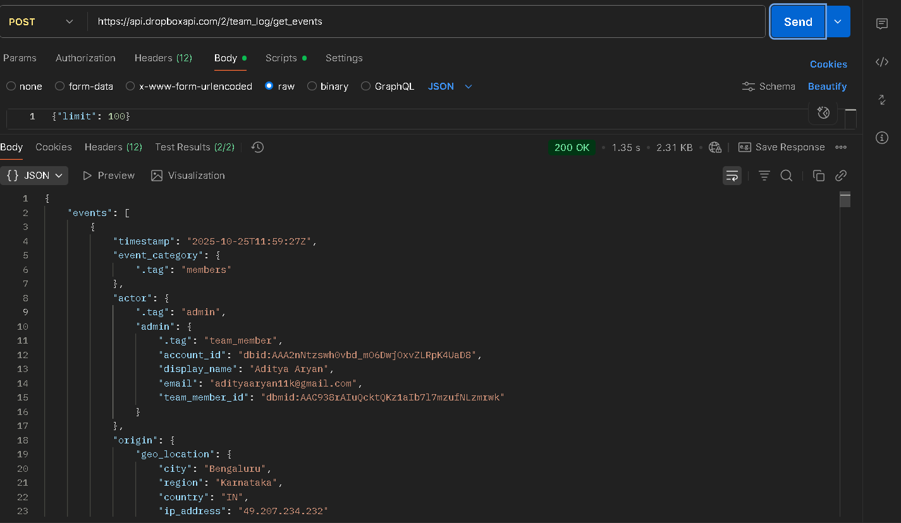
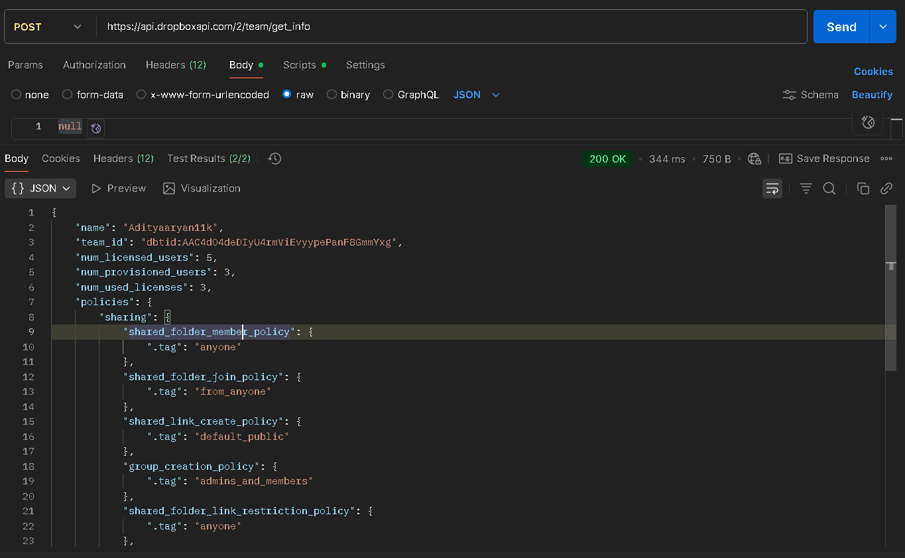

# CloudEagle Assessment — Dropbox (Business)

This document is a filled copy of the assessment template for Dropbox Business APIs.

## Authentication

In order to get a Client ID and Client Secret, create an OAuth app in the Dropbox App Console (choose a Scoped Access app, check "Team (Dropbox Business)" behavior if you need team endpoints).

Authentication type - OAuth2 (Authorization Code flow)

Auth URL: https://www.dropbox.com/oauth2/authorize

Access Token URL: https://api.dropbox.com/oauth2/token

Refresh Token URL: (same token endpoint; use grant_type=refresh_token to refresh)

Client ID/App ID: w256b2d5k1vh9gy

Client Secret/App Secret: <Secret Key>

Scopes: Required scopes for the Dropbox Business APIs:
- team_info.read
- team_info.write (only if writing)
- members.read
- team_data.member (verify exact scopes in console)
- team_logs.read (for team log / sign-in events)

Note: Dropbox scope names and granularity can change; confirm the exact scope names in the Dropbox App Console and the API docs.

Redirect URL: Set a redirect URL (e.g. http://localhost:4567/oauth) and use the same in Postman.

Postman Configuration/Authentication Screenshots: (Place screenshots here after testing)

---

## To get the name of the team/organization

Find the API (or set of APIs) that can be used to get the required data.

API URL:

https://api.dropboxapi.com/2/team/get_info

HTTP Method: POST

Parameters:
- Body: empty JSON object `{}`

Headers:
- Authorization: Bearer <access_token>
- Content-Type: application/json

Scopes:
- team_info.read

Request: Example

POST https://api.dropboxapi.com/2/team/get_info
Authorization: Bearer <ACCESS_TOKEN>
Content-Type: application/json

Body:
{}

Response: Example

{
    "name": "[TEAM_NAME]",
    "team_id": "[TEAM_ID]",
    "num_licensed_users": 5,
    "num_provisioned_users": 3,
    "num_used_licenses": 3,
    "policies": {
        "sharing": {
            "shared_folder_member_policy": {
                ".tag": "anyone"
            },
            "shared_folder_join_policy": {
                ".tag": "from_anyone"
            },
            "shared_link_create_policy": {
                ".tag": "default_public"
            }
        }
        // Additional policy details omitted for brevity
    }
}

Postman Testing Screenshots: 

---

## To get the plan type or the license assigned to the account

Notes: Dropbox Business does not expose a single "plan type" endpoint exactly labeled as "plan" in the Team API. Some plan-related info may be available via the Admin Console or via partner APIs. The closest useful endpoints and fields:

1) `team/get_info` — provides basic team metadata (team name, team_id, etc.). It does not explicitly return a plan name in many cases.

2) For license counts, `team/members/list` or `team/members/list_v2` can be used to infer licenses in use.

If you require explicit plan tier (e.g., "Standard", "Advanced"), it may not be exposed via the public Team API. In that case, note as: "No direct public API found to return plan name; admin console or partner API may be required."

API URL (recommended):

https://api.dropboxapi.com/2/team/get_info

Parameters: Body: `{}`

Scopes: team_info.read

Request: Example

POST https://api.dropboxapi.com/2/team/get_info
Authorization: Bearer <ACCESS_TOKEN>
Content-Type: application/json

Body:
{}

Response: Example

{ "team_id": "dbtid:...", "name": "Acme Corp" }

Postman Testing Screenshots: 

---

## To obtain the list of all users in the organization using this app

API URL:

https://api.dropboxapi.com/2/team/members/list_v2

HTTP Method: POST

Parameters: JSON body can include paging parameters; example uses default to get first page.

Body example:

{
  "limit": 100
}

Headers:
- Authorization: Bearer <access_token>
- Content-Type: application/json

Scopes:
- members.read

Request: Example

POST https://api.dropboxapi.com/2/team/members/list_v2
Authorization: Bearer <ACCESS_TOKEN>
Content-Type: application/json

Body:
{ "limit": 100 }

Response: Example

{
    "members": [
        {
            "profile": {
                "team_member_id": "dbmid:AAC938rAIuQcktQKz1aIb7l7mzufNLzmrwk",
                "account_id": "dbid:AAA2nNtzswh0vbd_mO6DwjOxvZLRpK4UaD8",
                "email": "adityaaryan11k@gmail.com",
                "email_verified": true,
                "status": {
                    ".tag": "active"
                },
                "name": {
                    "given_name": "Aditya",
                    "surname": "Aryan",
                    "display_name": "Aditya Aryan"
                },
                "membership_type": {
                    ".tag": "full"
                },
                "joined_on": "2025-10-25T11:59:26Z"
            },
            "roles": [
                {
                    "role_id": "pid_dbtmr:AAAAAFMcx6E0tax39Kb0H671TzWLeE07dwaqFQ5fDRy2",
                    "name": "Team",
                    "description": "Manage everything and access all permissions"
                }
            ]
        }
        // Additional members omitted for brevity
    ],
    "cursor": "AACsZnXfMEIJ7JVAQvOAlzneDfFXB2eWIJmq9ThkdWlciNV88ZFu8RAUdAHh-0F0TPul2ATrYUW8VW5RfLsP1aK6ZcioAoxMmvBjIUDzjQLYlA",
    "has_more": false
}

Postman Testing Screenshots: 

---

## To fetch sign-in events of all the users

Dropbox provides Team Log (audit) APIs which include events such as sign-ins. Use the Team Log API to query relevant events.

API URL:

https://api.dropboxapi.com/2/team_log/get_events

HTTP Method: POST

Body: Example — to filter sign-in events you can supply an event_types filter or search string; see docs.

Example body to request events:

{
  "filter": {
    "from_timestamp": "2020-01-01T00:00:00Z",
    "to_timestamp": "2025-12-31T23:59:59Z"
  },
  "limit": 100
}

Scopes:
- team_logs.read

Request: Example

POST https://api.dropboxapi.com/2/team_log/get_events
Authorization: Bearer <ACCESS_TOKEN>
Content-Type: application/json

Body: (see above)

Response: Example

{
    "events": [
        {
            "timestamp": "2025-10-25T12:10:17Z",
            "event_category": {
                ".tag": "logins"
            },
            "actor": {
                ".tag": "admin",
                "admin": {
                    "account_id": "dbid:AAA2nNtzswh0vbd_mO6DwjOxvZLRpK4UaD8",
                    "display_name": "Aditya Aryan",
                    "email": "adityaaryan11k@gmail.com"
                }
            },
            "event_type": {
                ".tag": "logout",
                "description": "Signed out"
            },
            "details": {
                ".tag": "logout_details",
                "login_id": "AACbzr8e08fSZvIQqZfvhaQOcZyP0yIQY6yKdwW-y3zeWw"
            }
        }
    ],
    "cursor": "AAFRmJDu7oHwKwzpT3drGwB3k_iRBu5n0EsvZFHCwrTTkvg34w5Aq9q2TpGobh6czrbAFemfRoXwd8mpwp8AVJr9ssu2dcemerO5JEx7JfZdSH7o_NXu6CBFHHSO33nwEgQXwvEo4wn9047tHA8stQyIPKOkFtBax3RW_WUeCPSvn_JpaTUa4BjCd1BcZaHSnRj-KklS0h4RGetZPHd6TLS8S1NLl0yBfiq9GX15AtOTolyX0tgFeJwDkDolx3O5YLBt2zDzhBAZLfvr6j_VYyStpEI8lh0uJq0isyKuBwHW_L6O83mX4cJ7kBPvxmyQYkDllH0mQsLwFg6vrx-BDHHa3uSkfzx9yyw7kxep9Q0yMNvRgtKut8Q5Tu6wUcEjcmA",
    "has_more": false
}

Note: event type names vary; filter for login/sign-in related events (search for "sign in", "login", or check event type ids).

---

End of template.
